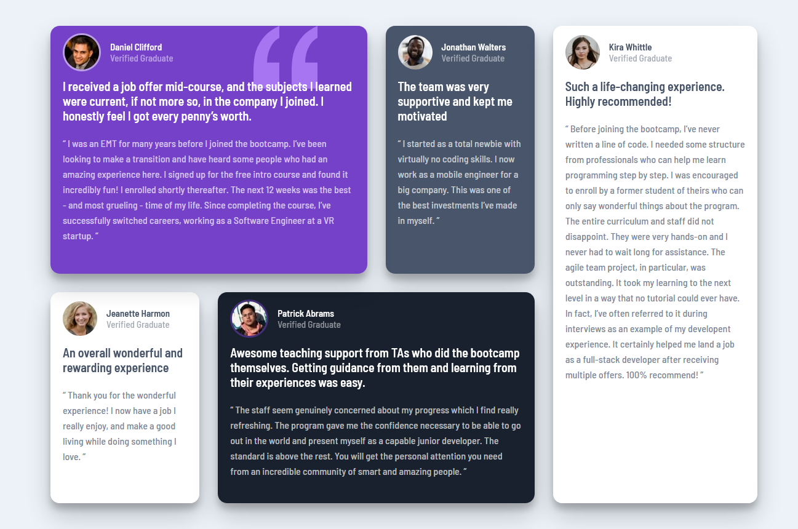

# Frontend Mentor - Testimonials grid section solution

This is a solution to the [Testimonials grid section challenge on Frontend Mentor](https://www.frontendmentor.io/challenges/testimonials-grid-section-Nnw6J7Un7). Frontend Mentor challenges help you improve your coding skills by building realistic projects. 

- [Overview](#overview)
  - [The challenge](#the-challenge)
  - [Screenshot](#screenshot)
  - [Links](#links)
  - [My process](#my-process)
  - [Built with](#built-with)
  - [What I learned](#what-i-learned)
  - [SASS Snippet](#sass-snippet)
  - [Continued development](#continued-development)
  - [Useful resources](#useful-resources)  
- [Author](#author)
  
## Overview

### The challenge

Users should be able to:

- View the optimal layout for the site depending on their device's screen size

### Screenshot



### Links

- Solution URL: [FrontendMentor Solution](https://www.frontendmentor.io/challenges/testimonials-grid-section-Nnw6J7Un7/hub/html-css-sass-grid-Fnh1KGXdL)
- Live Site URL: [Live Site](https://testimonial-grid-view.netlify.app/)

## My process

### Built with

- Semantic HTML5 markup
- CSS custom properties
- Flexbox
- CSS Grid
- SASS

### What I learned

I learned CSS grid while developing this design project. I am familiar with grid columns and grid rows now.

### SASS Snippet

I like using sass you can nest the classes inside the parent class instead of creating one seperate this is much helpful. 

```css
.daniel-card {
  padding: 1rem 2rem;
  width: 100%;
  border-radius: 1.5rem;
  background: $primary_moderate_violet;
  box-shadow: 0px 10px 10px rgba($color: #000000, $alpha: 0.2),
    0px 20px 40px rgba($color: #000000, $alpha: 0.2);
  background-image: url("/img/bg-pattern-quotation.svg");
  background-repeat: no-repeat;
  background-position-x: 90%;
  grid-column: 1 / 3;
  grid-row: 1 / 3;

  .daniel-avatar {
    @include flex(flext-start, center, row);

    .daniel-title {
      padding: 1.5rem;
    }

    img {
      border-radius: 50%;
      border: 3px solid rgba(255, 255, 255, 0.5);
    }

    h3 {
      font-size: $header4;
      color: $primary_white;
    }

    h4 {
      font-size: $header4;
      font-weight: lighter;
      color: $primary_white;
      opacity: 50%;
    }
  }

  .daniel-testimonial {
    margin-top: 1rem;
    h1 {
      color: $primary_white;
    }

    p {
      margin-top: 2rem;
      margin-bottom: 4rem;
      color: $primary_white;
      line-height: 2.5rem;
      opacity: 70%;
      font-size: medium;
    }
  }
}
}
```

### Continued development

I want to continue my development in HTML5, CSS3, SASS, JavaScript and looking forward to learn Node.js, Express and Web build tools like Webpack.js .

### Useful resources

- [A Complete Guide to Grid](https://css-tricks.com/snippets/css/complete-guide-grid/) - This article helped me to learn grid in depth very useful resource please take a read if you want build grid layout web page. 

## Author

- Frontend Mentor - [@Pritam-Tirpude](https://www.frontendmentor.io/profile/Pritam-Tirpude)
- Twitter - [@ptirpude1991](https://twitter.com/ptirpude1991)
